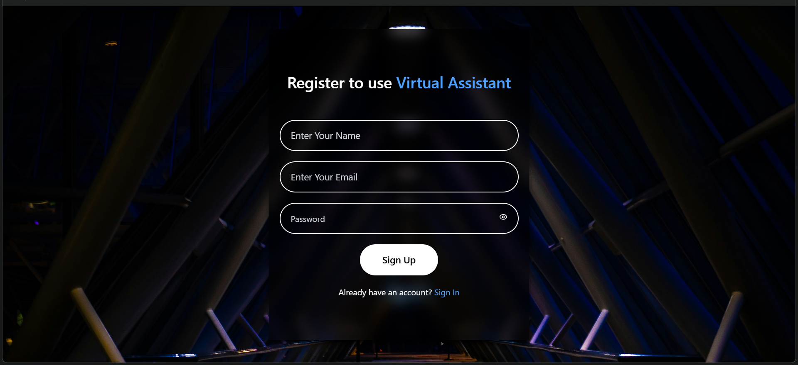
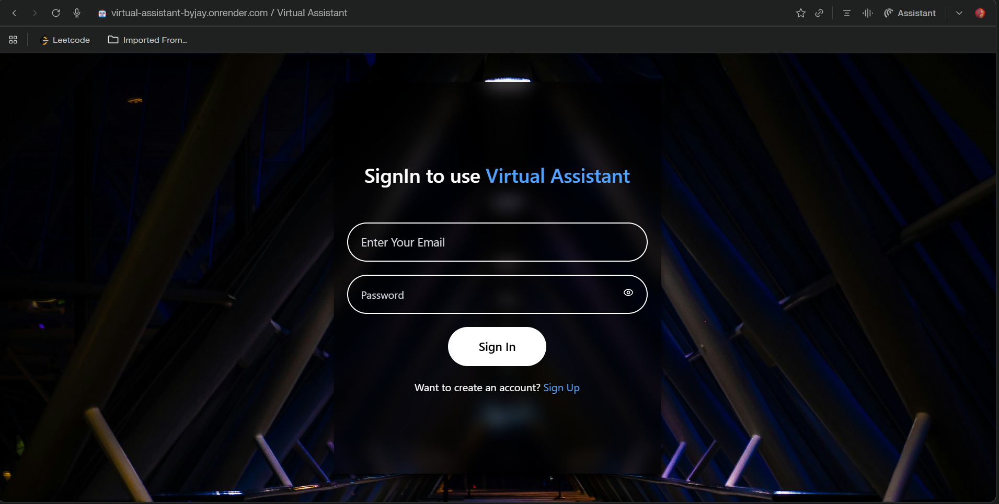
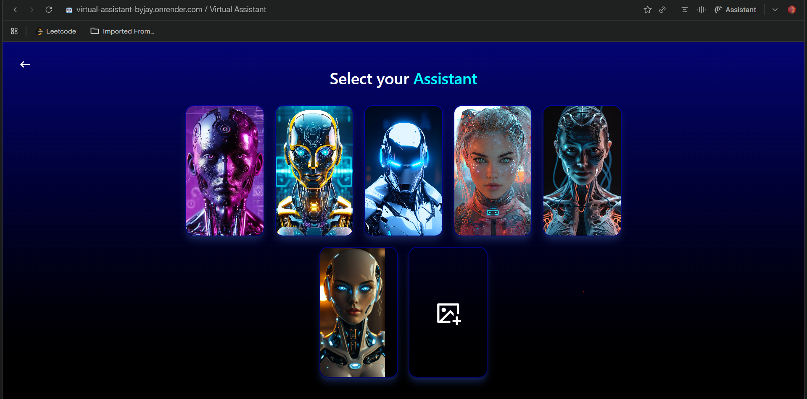
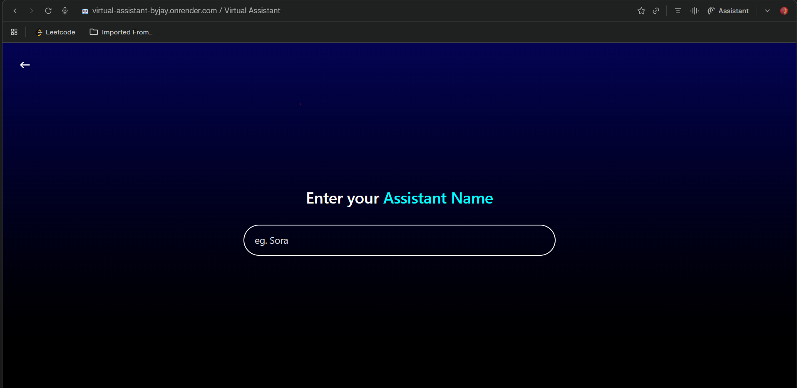
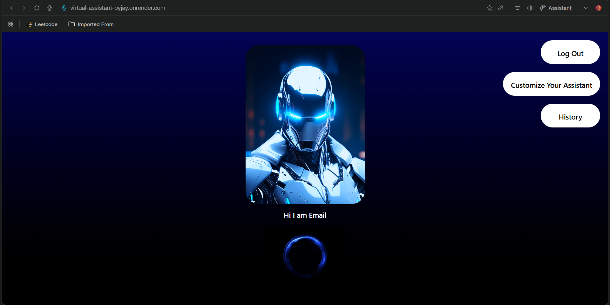

# 🤖 Virtual Assistant – AI Powered Voice Assistant


A full-stack **AI Voice Assistant web application** that enables users to interact using **voice commands**, customize their own assistant, and receive intelligent responses powered by the **Google Gemini API**.

---

## 🌐 Live Application

| Component | URL |
|-----------|-----|
| **Frontend** | [https://virtual-assistant-byjay.onrender.com](https://virtual-assistant-byjay.onrender.com) |
| **Backend** | [https://virtualassistant-byjay-backend.onrender.com](https://virtualassistant-byjay-backend.onrender.com) |

---

## 📌 Overview

**Virtual Assistant** is a modern AI-based web application that combines **voice recognition**, **speech synthesis**, and **generative AI**. Users can talk to the assistant, ask questions, perform web searches, play YouTube videos, calculate results, check the weather, and more — all through a hands-free voice interface.

---

## 📸 Screenshots

> **Note:** These images are stored in the `screenshots/` folder.

### 🔐 Authentication
| Sign Up | Sign In |
|:---:|:---:|
|  |  |
| *User registration with validation* | *Secure login with error handling* |

### 🎨 Customization
| Choose Avatar | Set Name |
|:---:|:---:|
|  |  |
| *Select presets or upload via Cloudinary* | *Personalize assistant identity* |

### 🏠 Main Interface
| Home & Listening |
|:---:|:---:|
|  |
| *Voice command interface* |


---

## 🎯 Features

### 🔐 User Authentication
- JWT-based authentication with httpOnly cookies
- Password hashing using `bcryptjs`
- Session expiration: 7 days

### 🎙️ Voice Interaction
- Speech-to-text via Web Speech API
- Text-to-speech in English & Hindi
- Hands-free command execution

### 🧠 AI Intelligence
- Google Gemini API (`gemini-3-flash-preview`)
- Context-aware conversation handling
- Command classification & execution

### 🎨 Personalization
- Custom assistant name
- Predefined or custom avatar upload via Cloudinary & Multer

### 🌍 Smart Commands Supported
- Google search & YouTube
- Social media (Instagram, Facebook)
- Calculator commands
- Time, Date, Day, Month queries
- Weather information
- General knowledge Q&A

### 📱 Responsive Design
- Tailwind CSS
- Mobile-first layout
- Works on all devices

---

## 🧱 Tech Stack

### Frontend
- **Framework:** React.js + Vite
- **Styling:** Tailwind CSS
- **State Management:** Context API
- **Voice:** Web Speech API
- **Routing:** React Router DOM

### Backend
- **Runtime:** Node.js
- **Framework:** Express.js
- **Database:** MongoDB + Mongoose
- **File Storage:** Cloudinary & Multer
- **Auth:** JWT (JSON Web Tokens)
- **AI:** Google Gemini API

---

## 📁 Project Structure

```bash
Virtual Assistant/
├── frontend/
│   ├── src/
│   │   ├── components/
│   │   │   └── Card.jsx
│   │   ├── context/
│   │   │   └── UserContext.jsx
│   │   ├── pages/
│   │   │   ├── Home.jsx
│   │   │   ├── SignUp.jsx
│   │   │   ├── SignIn.jsx
│   │   │   ├── Customize.jsx
│   │   │   └── Customize2.jsx
│   │   ├── App.jsx
│   │   ├── main.jsx
│   │   └── index.css
│   └── package.json
│
└── backend/
    ├── config/
    │   ├── db.js
    │   ├── cloudinary.js
    │   └── token.js
    ├── controllers/
    │   ├── auth.controller.js
    │   └── user.controllers.js
    ├── middlewares/
    │   ├── isAuth.middleware.js
    │   └── multer.middleware.js
    ├── models/
    │   └── user.model.js
    ├── routes/
    │   ├── auth.routes.js
    │   └── user.routes.js
    ├── gemini.js
    ├── index.js
    └── package.json
